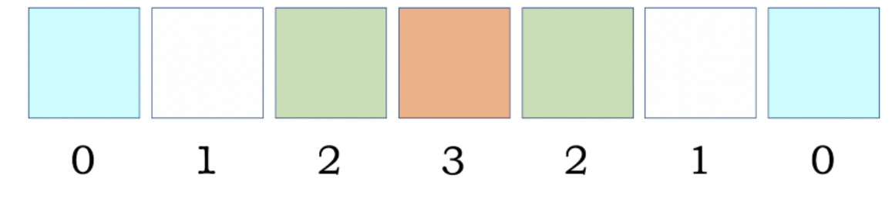

# Image Processing

## What is an image processing?

Image processing is the output of self-generated pixels and may decide for itself; because of statistical randomness and algebraic rules. That is all the if-then conditional statements are in the first place. The trick is finding ways to make algebra create something perceptual by using RGB pixel values.

Images processing determines the RGB color space as the HSL color space of each element-time. Each color space plays a part in advancing the system through each generation. Although the statistics are simple and easy to understand, complex patterns emerge from randomness and form fascinating results.

Algebra is responsible for creating boundaries, but even something so exciting as life is predictable. Since the general rule determines the factor for each subsequent generation. The way to produce unforeseeable results is to introduce randomization at the very beginning. In the beginning, there was a random pixel that made every subsequent generation unique without the need to change the rules.

The best example of image processing is a combination of both randomness and predictability to manifest something perceptual that is also statistically irreproducible.

## WHY?

### Experience

Image processing is an opportunity to demo my skills. This domain expertise is a gateway into concepts like abstract art.

### Results

Images that do not (test) resemble each other, but are the results of the same system.

## Where to begin

The pixel is the most crucial step to perception. Here is the tech required to achieve the result. My image processing project uses Python and to help with pixel manipulation will be Pillow.

## Image [TILES][NUM_OF_IMG][IMGTILES]

In computer graphics, an image is a 2D bitmap that is integrated into a larger scene, most often in a file. Originally, the term "image" referred to fixed-sized objects composited together, by hardware, with a background.

## Key Concept

This program creates m*n pixel matrix image with random
RGB and output resembled multi-colored images.

Here some pixel manipulation practice in Python. I want to specify the shape, size, and number of images.

Here's a look at the image:

### Image 7x7-30–1900


### Image 43x43-6–1900


These two images don't resemble each other, but both images are the results of the same system. Due to the randomness and predictability of the images generated by the same system, there is a high probability that even with the same arguments, these images will forever be one of a kind. The random sample of RGB values provides an unbiased evaluation of an image (test).

## Script

Virtually setup Python and pip install the necessary libraries. Once you have the environment set up, you can write code into a file with extension .py and execute with the following command:

```txt
python script.py [TILES][NUM_OF_IMG][IMGTILES]
```

For example, the command to create the first matrix of images from above would be:

```txt
python script.py 7 30 1900
```

## Overview

This solution is perfect. It showcases image processing and doesn't take a tone of code. I'll explain the code.

The main function starts by creating the initial image and
sets the size of pixel:

```python
pixel = imgTiles
newImg = Image.new('RGB', (pixel, pixel))
```

The two for loops are responsible for defining a border for each image, basically dividing the dimensions of the picture by the number of images requested. These values are used to determine the coordinates for each image.

```python
  for x in range(0, num_of_img):
    for y in range(0, num_of_img):
      topLeftX = x*imageTiless + padding/2
      topLeftY = y*imageTiless + padding/2
      botRightX = topLeftX + imageTiless - padding
      botRightY = topLeftY + imageTiless - padding
      create_image((topLeftX, topLeftY, botRightX, botRightY), draw, tiles)
```

Let’s ignore padding and take a look at the image. Imagine that each of the four squares represents a image with a size of 1. The border that is being passed to the next function refers to the top left and bottom right coordinates. So the tuple for the top left image would be (0,0,1,1) whereas the tuple for the top right would be (1,0,2,1). These will be used as the dimensions and base coordinates for the squares of each image.

### Example of determining image borders

The function create_border determines the border for each square within the picture. The same process for determining the border is applied here, only instead of the full image we’re using a pre-determined border to work inside. These final coordinates for each square will be used in the next function to actually draw the image.

### Example of breaking down a 3x3 image

To determine the element, a simple array of three random RGB tuples and three black are used to simulate a 50% chance of being drawn. The lambda functions near the top of the code are responsible for generating the elements (Think Doppler Effects).

The real trick of this function is creating symmetry. Each square is paired with an element value. In the illustration below you can see the element values increment as they reach the center and then decrement as we leave the center. Squares with matching element values are drawn with the same RGB values.

Centroid of rectangle is defined as the center point where all the diagonals intersect each other. The diagonals of the rectangle intersect at width b/2 from x - axis and at height h/2 from y - axis. It can also be termed as the geometric center.

### Element values and symmetrical colors for a row in a 7x7 image



## Conclusion

As create_square receives its parameters from create_image, it uses a queue and the element values from create_border to ensure symmetry. The first occurrence of the element values have their colors push forward onto the queue and the mirrored squares black the colors off or 0 or False.